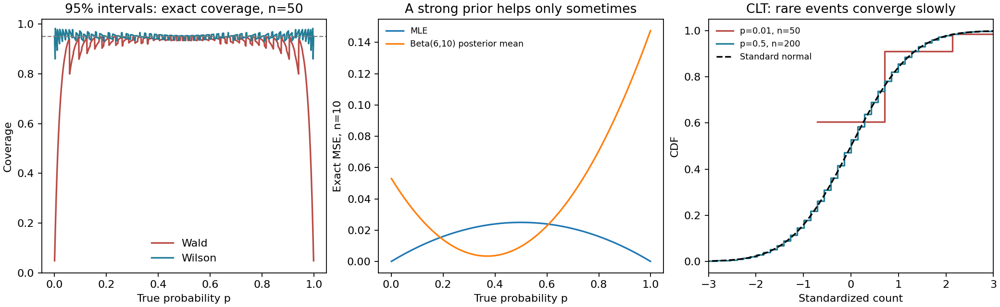

# Probability Experiments: Bernoulli Estimation and the Central Limit Theorem

## New: when the approximation fails



The reproducible experiment now checks three questions: Does a nominal 95%
interval actually cover the true probability? When does a Beta prior improve
estimation? How misleading can a normal approximation be for rare events?

```bash
# Python 3.11; no external datasets or network calls during the experiment
python -m pip install -r requirements-reproduce.txt
python -m unittest -v test_experiment
python experiment.py --seed 7
```

This produces [metrics.json](results/metrics.json) and the figure above. Coverage
is computed by summing the **exact binomial distribution**, not estimating it
from a simulation. MSE is computed analytically and independently checked using
100,000 seeded repetitions for each of 16 combinations of n and p.

For a true success probability of 1%:

| Trials | Wald interval coverage | Wilson interval coverage |
|---:|---:|---:|
| 10 | 9.55% | 90.44% |
| 50 | 39.48% | 91.06% |
| 200 | 86.50% | 94.83% |
| 1,000 | 92.70% | 96.35% |

Both intervals are nominally 95%; neither has exactly 95% coverage for every
discrete sample size and probability. Wilson helps substantially in these cases,
but is not an exact-coverage guarantee. Formula reference:
[NIST confidence intervals for proportions](https://www.itl.nist.gov/div898/handbook/prc/section2/prc241.htm).

At p=0.01 and n=10, MLE MSE is 0.00099 while the Beta(6,10) posterior mean's
MSE is 0.05060: a mismatched strong prior hurts. At the prior mean p=0.375,
it helps. The curve shows both regimes rather than selecting only favorable cases.

Five regression tests verify boundary behavior, symmetry, exact risk against
independent enumeration, invalid inputs, and the rare-event failure case.
GitHub Actions reruns the calculations and publishes generated artifacts.

## Original exploratory notebook

A compact, executable study of discrete and continuous random variables,
Bernoulli parameter estimation, and the Central Limit Theorem (CLT). The
notebook connects each mathematical result to a NumPy/SciPy experiment and a
visual check.

## What this demonstrates

- Expected value and variance for a discrete distribution
- Numerical integration for a continuous probability density
- Maximum-likelihood and Bayesian estimates for a Bernoulli parameter
- Convergence of sample means toward a Gaussian distribution as sample size
  increases

## Quick start

```bash
git clone https://github.com/takakhoo/probability-clt-lab.git
cd probability-clt-lab
python -m venv .venv
source .venv/bin/activate  # Windows: .venv\Scripts\activate
python -m pip install -r requirements.txt
jupyter lab "Bernoulli CLT Experiment.ipynb"
```

[Open the executed notebook](Bernoulli%20CLT%20Experiment.ipynb)

## Mathematical focus

For independent Bernoulli trials with success probability \(p\), the notebook
compares the empirical sampling distribution with

\[
\sqrt{n}(\bar X_n-p) \xrightarrow{d} \mathcal{N}(0,p(1-p)).
\]

The cells are arranged as an exploratory lab: change the prior, success
probability, sample size, or number of simulations and rerun from top to bottom.

## Verification

The notebook has been seeded and re-executed from first cell to last without
errors. Its final exercise bootstraps a finite uniform sample; the figure now
labels that correctly. It is not the same experiment as drawing each observation
independently from the continuous population. The new script uses binomial
sampling and exact binomial calculations instead.

## Scope

This is an educational experiment, not a general-purpose statistics package.
It is useful as a transparent reference for the assumptions and mechanics
behind common estimators and asymptotic approximations.
